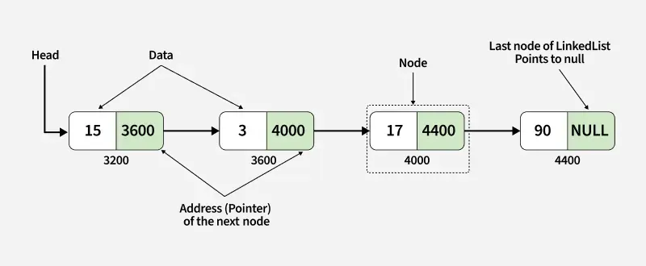

# Linked List

**Node**: an abstract data structure that stores data and a pointer to other node(s).

**Linked List**: a data structure that stores data in an ordered manner. It uses node objects containing data and a "next" pointer that points to the next node in the list.

**Head**: the start node of a linked list.

It is essential to keep a reference to the head node of the linked list because the head is the only node from where you can reach all subsequent elements in the linked list. In a normal linked list, you can only go forwards; there is no way to navigate from a node to the previous node.



## Code

```c++
struct LinkedListNode
{
	int val;
	LinkedListNode *next
	LinkedListNode(int val) : val (val), next(nullptr) {}
}

int main()
{
	LinkedListNode *one = new LinkedListNode(1);
	LinkedListNode *two = new LinkedListNode(2);
	LinkedListNode *three = new LinkedListNode(3);
	
	one->next = two;
	two->next = three;
	
	LinkedListNode* head = one;
	
	std::cout << head->val << std::endl;
	std::cout << head->next->val << std::endl;
	std::cout << head->next->next->val << std::endl;
}
```
## Advantages

- $O(1)$ insertion and deletion of elements at any position in the linked list on the condition that you have a reference to a node at the position to perform the insertion/deletion.
	- If you don't have a reference to a reference to the node at the position you want to insert/delete, the operation is $O(n)$, because you need to iterate from the head to the desired position.
		- Since dynamic arrays require $O(n)$ to add and remove from an arbitrary position, linked lists are better.

- Due to the node-based structure, linked lists do not have a fixed size. While dynamic arrays can be resized, under the hood they are still allocated a fixed size - it's just that when this size is exceeded, the array is resized, which is expensive.

## Disadvantages

- There cannot access any arbitrary element (after the head) because you would have to iterate until the desired element is found.
	- Arrays are superior in this regard as they have $O(1)$ indexing, while linked lists require $O(n)$ to access an element at a given position.

- Linked lists have a higher memory overhead than arrays. Every node must have extra storage for a "next" pointer to link the node to the following node in the list.