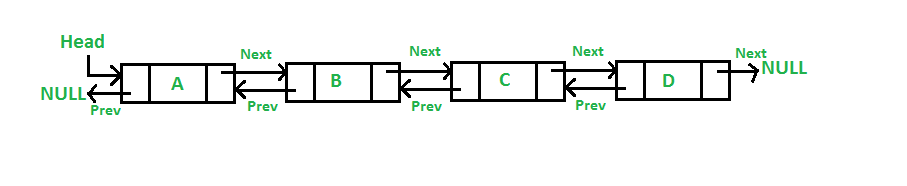

# Doubly Linked List

A doubly linked list contains nodes that each have a pointer to the *previous* node and the *next* node. This allows you to traverse either backwards or forwards in the list.

In a singly linked list, you need a reference to the node at `index - 1` to add or remove at `index`. This is because we needed to perform operations on the previous node. With a doubly linked list, you only need a reference to the node at `index` because you can simply reference the previous node through the node at `index` through it's previous node pointer.



## Linked Lists with Sentinel Nodes

**Sentinel nodes** sit at the start and end of linked lists and are used to make operations and the code needed to execute those operations cleaner. The idea is that, even when there are no nodes in a linked list, you still keep pointers to a `head` and the `tail`. The real head of the linked list is `head.next` and the real tail is `tail.prev`. The sentinel nodes themselves are not part of the linked list.

Sentinel nodes also allow you to easily add or remove from the front or back of the linked list. Addition and removal is only $O(1)$ if you have a reference to the node at the position to perform the operation. With the sentinel tail node, we can perform operations at the end of the list in $O(1)$.

## Code

```c++
struct ListNode
{
	int val;
	ListNode *next;
	ListNode *prev;
	ListNode(int val) : val(val), next(nullptr), prev(nullptr) {}
};
```

## Algorithms

### Add Node

```c++
// Node is the node at position i
void add_node(ListNode *node, ListNode *node_to_add)
{
	ListNode *prev_node = node->prev;
	node_to_add->next = node;
	node_to_add->prev = prev_node;
	prev_node->next = node_to_add;
	node->prev = node_to_add;
}
```

### Remove Node

```c++
// Node is the node at position i
void delete_node(ListNode *node)
{
	ListNode *prev_node = node->prev;
	ListNode *next_node = node->next;
	prev_node->next = next_node;
	next_node->prev = prev_node;
}
```

### Addition @ Start & Deletion @ End with Sentinels $O(1)$

```c++
ListNode *head = new ListNode(-1);
ListNode *tail = new ListNode(-1);

head->next = tail;
tail->prev = head;

void add_to_start(ListNode *node_to_add)
{
	node_to_add->prev = head;
	node_to_add->next = head->next;
	head->next->prev = node_to_add;
	head->next = node_to_add;
}

void remove_from_start()
{
    if (head->next == tail) {
        return;
    }

    ListNode *node_to_remove = head->next;
    node_to_remove->next->prev = head;
    head->next = node_to_remove->next;
}

void add_to_end(ListNode* node_to_add) {
    node_to_add->next = tail;
    node_to_add->prev = tail->prev;
    tail->prev->next = node_to_add;
    tail->prev = node_to_add;
}

void remove_from_end() {
    if (head->next == tail) {
        return;
    }

    ListNode *node_to_remove = tail->prev;
    node_to_remove->prev->next = tail;
    tail->prev = node_to_remove->prev;
}
```
